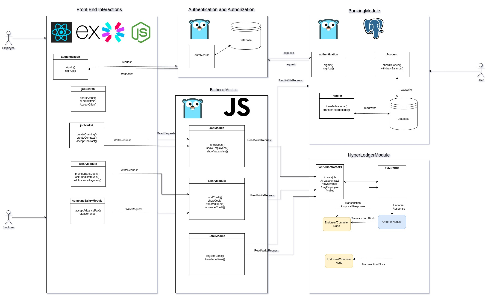

# Software Architecture and SRS document for Borderpay.io
## Rudranil Bhowmik(18111055)
## Dhilipkumar (231110026)
---
---
## Architecture Diagram

## Functional Requirements

### Creating Accounts

- We need to allow creation of accounts in order for an individual to come and open an account on our Platform as an employee or an employer.
- The employer needs to attach to a bank acoount with a bank that is registered on the blockchain.

### Authentication

- We will create a parallel authenctication system using JWT or any other similar tech for our app.
- Authentication records stored on the blockchain are immutable, meaning they cannot be tampered with or altered once written. 
- So taking that and wrapping it in an externalauthenticator helps us with that.

### Job Search

- An employee should be able to see the jobs that are listed on the website.
- An employeer should be allowed to post a job for the job search page.
- Each instance of job is treated as a single entry by the employer.
  
### Contract Handling

- Whenever an employer finds a suitable candidate he sends them the contract with salary and duration.
- If the employee accepts, the employee can start the work.
- The contract is mutually terminable and can be started from any side.

### Banking System

- Everyone with should have a registered bank account.
- The money will be transferred to the said bank account.
- Tranfer can be made between banks under agreed principles.
- Banks have voluntary participation on the blockchain.
- International Transfers will happen on this system.

### Credit System

- Everyone with a job will have to register to this system.(Automatically created when entering bank details).
- Can withdraw any number of times or in fixed intervals.
- Can request for pre-credits under said conditions.

## Non-functional requirements

### Performance:

#### Requirement
**The application should respond quickly to user interactions and provide a smooth user experience.**

 - Utilize React's virtual DOM and efficient rendering mechanisms to minimize page load times and optimize component rendering.
 - Optimize smart contract execution and transaction processing on the Hyperledger blockchain to minimize latency in contract enforcement and payment handling.

### Storage:

#### Requirement: 
**The application should efficiently store and manage data to minimize storage overhead and ensure data integrity.**
 - Utilize Hyperledger Fabric or Hyperledger Besu as the blockchain framework to provide a distributed ledger for storing immutable transaction records securely.
 - Employ a database solution like MongoDB or PostgreSQL to store structured data efficiently and provide scalability options for non-blockchain data storage.

### Latency:

#### Requirement: 
**The application should minimize latency for network requests to ensure responsive user interactions.**
- Use HTTP/2 or WebSocket protocols to enable efficient communication between the frontend, backend, and Hyperledger blockchain network, reducing latency for real-time interactions.
  
### Scalability:

#### Requirement: 
**The application should be able to handle increased user load and data volume without sacrificing performance or reliability.**
 - Deploy Hyperledger nodes across multiple servers or cloud instances to distribute the workload and achieve horizontal scalability.
 - Design microservices architecture for the backend components to decouple and scale individual services independently, facilitating better resource utilization and fault isolation.
 - Utilize containerization (e.g., Docker) and orchestration tools (e.g., Kubernetes) to manage application instances and Hyperledger nodes, enabling dynamic scaling based on demand.

Keeping all this in mind, let's get an average estimate for our network.

### Hyperledger Fabric:

- Assuming a Hyperledger Fabric network configured for moderate transaction throughput, such as 50-100 transactions per second (TPS).
- Let's assume an average contract involves 2 transactions (e.g., contract creation and contract execution).
- So, the Hyperledger Fabric network can potentially handle 25-50 contracts per second.

### Backend-API

- A well balanced and setup machine can serve 25 requests per second.
- This happens cause it requires high amount of compute power to retreive and send data after processing.

### React Frontend

- Assuming efficient client-side rendering and optimized network communication, the React frontend should be able to handle a large number of concurrent users and requests.
- The React frontend primarily serves static assets and interacts with the backend via HTTP requests.
- So it can serve quite a large number of concurrent users. Since all will be served from same server we can estimate 50-75 concurrent users.

So, Based on these estimates, and assuming a balanced workload distribution between contracts, backend requests, and frontend users, a single server could potentially support processing:

- Contracts: 25-50 contracts per second
- Backend Requests: ~25 requests per second
- Frontend Users: 50-100 concurrent users